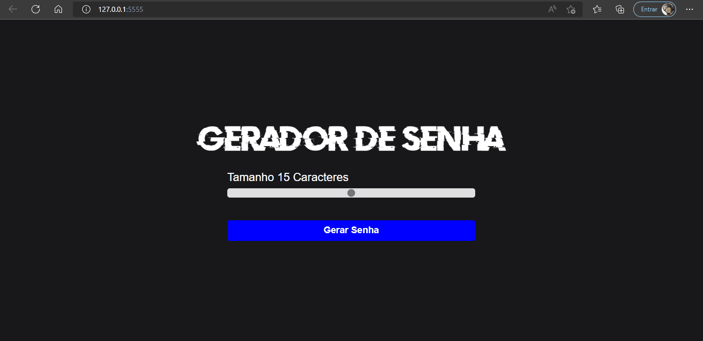
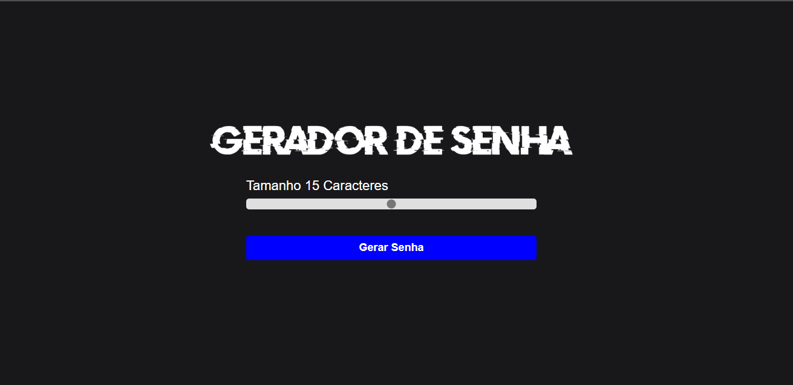

 **Projeto Gerador de Senhas** 
 ##### Nele o usuário tem a opção de escolher quantos carácteres deve ter sua senha. Nos caracteres adicionei letras, números e símbolos. Função copiar senha foi adicionada.🚀

 ##### Para usar é bem simples o usuário deve escolher a quantidade de caracter que a senha deve ter, clicar em gerar senha e por último clicar para copiar a senha, na tela irá aparecer uma mensagem alertando que a senha foi copiada, 

 ##### Objetivo do projeto trabalhar com as  tríade do Front-end

 []

[]

### Tecnologias utilizadas

 

  
  

   
   

[ ]
